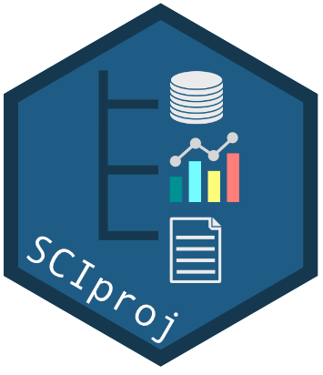

<!-- README.md is generated from README.Rmd. Please edit that file -->

# SCIproj 

An R package for the initialization and organization of a scientific
research project following reproducible research guidelines.

## Overview

SCIproj provides the function `create_proj()` which creates a new
project as an R package with a slightly modified folder structure:

    project
    |- data-raw/        # Optional folder for raw data files and R scripts to generate tidy datasets.
    |   |- clean_data.R # Script template for data pre-processing and storing of .rda files.
    |   +- ..
    |                   
    |- data/            # Cleaned datasets stored as .rda files; will not be altered once created.
    |- r/               # Custom R functions and documentation files of clean datasets.
    |   |- data.R       # Template file for the dataset documentation.
    |   +- ..    
    |   
    |- analyses/        # R scripts or R Markdown documents involving different analyses for the project.
    |   |- figures/     # Generated plots can be saved in this default subfolder.
    |   +- ..           # Individual analyses and output files could be also placed in subfolders.
    |
    |- docs/            # Individual publication-ready documents (journal article, report, presentation)
    |                   # in separate folders.
    |
    |- trash/           # Temporary files that can be safely deleted.
    |- README.Rmd       # The top level description of the project.
    +- makefile.R       # Executable Makefile for this study (optional).

The data pre- and post-processing steps in a research project are
separated into the `data-raw/` and `analyses/` folders. Any homemade
functions are stored in the `R/` folder and should be documented using
roxygen. R Markdown files to create presentations, reports or papers go
into the `docs/` folder. Any temporary files that can be deleted at a
later step can be placed into a `trash/` folder.

Organizing the project as an R package offers the following advantages:

- The raw, unaltered data is kept separately from the cleaned data that
  is used in the analyses. A script file(s) is provided that documents
  the data pre-processing, i.e. the cleaning of the raw data. This/These
  should be stored along with the raw data in `data-raw/`.
- Cleaned datasets are stored in individual .rda files and, ideally,
  documented using roxygen. These documentation files are stored in the
  `R/` folder.
- Code for homemade functions is kept separately from the actual
  analyses code and stored in individuals files. The roxygen
  documentation helps with the usability and traceability.
- Manuscript production output is kept separate from everything else.
- The `trash/` directory can be used for experimentation. Everything in
  this directory can be deleted at any time without negative impact.
- The project itself is well documented in the top-level README file,
  including the description of important input and output data files. In
  addition, there is a README file in every directory, describing the
  purpose of the directory and its contents.
- The top-level DESCRIPTION file provides a short project summary, lists
  all contributors and the R packages needed to run the analyses.
- A top-level Makefile or R Markdown file could be used that documents
  the computational study in executable form.
- A great advantage of having the project as an R package is when
  loading it all clean datasets and custom functions including their
  documentation are immediately available.

## Installation and usage

Install the development version from GitHub using remotes:

``` r
# install.packages("remotes")
remotes::install_github("saskiaotto/SCIproj")
```

### Creating the project structure

First, load the package:

``` r
library("SCIproj")
```

Now run the function `create_proj()` to create a directory with all the
scaffolding:

``` r
create_proj("my_research_project")
```

The function provides several options such as:

- `data_raw = TRUE` (default) adds the ‘data-raw’ folder for all the raw
  data files, including a ‘clean_data.R’ script file.
- `makefile = TRUE` adds a template ‘makefile.R’ file to the project.
- `testthat = TRUE` adds testthat infrastructure.
- `use_pipe = TRUE` (default) adds magrittr’s pipe operator to the `R/`
  folder.
- `add_license = "Your name"` → If you want to use a license than
  replace ‘Your name’ with your own name.
- `create_github_repo = TRUE` creates a GitHub repository. Note that
  this requires some working infrastructure like *git* and a
  *GITHUB_PAT*. See instructions here .
- `ci` defines the type of continuous integration in your GitHub
  repository. Current options are “none” (default), “travis” (uses
  Travis-CI), “circle” (uses Circle-CI), “appveyor” (uses AppVeyor), or
  “gh-actions” (uses GitHub Actions).

### Developing the project

1.  Create the project with `create_proj()`.

2.  Edit the `DESCRIPTION` file with some basic information about your
    project: title, short summary, contributors, license, package
    dependencies, etc.

3.  Now edit the `README.Rmd` file. Provide again the title of the
    project and describe in more detail relevant project details,
    e.g. objectives, timeline, workflow, etc.

4.  Place original (raw) data in `data-raw/` folder. Use either the
    ‘clean_data.R’ file for all your data pre-processing or use
    individual R scripts (or R Markdown documents) for each dataset. To
    store each dataset as .rda file it is recommended to use the
    function `usethis::use_data()`, which will place the .rda files
    automatically in the `data/` folder.

5.  Save final (clean, tidy) datasets in the `data` folder. If you use
    `usethis::use_data()`, this will be done automatically.

6.  For better reproducibility document all your clean datasets that go
    into the analyses using roxygen. [Documenting
    data](http://r-pkgs.had.co.nz/data.html#documenting-data) is similar
    to documenting a function with a few minor differences. Instead of
    documenting the data directly, you document the name of the dataset
    and save it in the `R/` folder. You can either write the
    documentation for each dataset in an individual .R file or write
    them together in one file. SCIproj provides already a template
    (`data.R`) for the multiple dataset documentation.

7.  If you write your own functions, place them in the `R` folder.
    Document all your functions with roxygen (for more infos see the
    documentation chapter in the [R
    Packages](http://r-pkgs.had.co.nz/man.html) book). If your function
    uses functions from other CRAN packages list them in the fields
    `@import` or `@importFrom` to import these dependencies in the
    namespace.

8.  To ensure that your code does what you want it to do it is best to
    [write tests](http://r-pkgs.had.co.nz/tests.html) for your functions
    and place them in the `tests/` folder, which will be created if you
    set `testthat = TRUE` in the `create_proj()` function.

9.  R scripts or R Markdown documents used for the data analyses are
    placed in the `analyses/` folder, all generated plots can be saved
    in the automatically created `figures/` subfolder.

10. The final manuscript, thesis or report and presentation slides will
    be placed in the `docs` folder. For better reproducibility use R
    Markdown. In addition to the default templates there are many other
    templates available. See for instance the packages
    [rticles](https://github.com/rstudio/rticles),
    \[thesisdown\](<https://github.com/ismayc/thesisdown>,
    [rmdformats](https://github.com/juba/rmdformats),
    [rmdTemplates](https://github.com/Pakillo/rmdTemplates) or
    [iosp](https://github.com/koncina/iosp).

11. Include all CRAN packages that are used in your analyses and
    publication documents as dependencies (`Imports`) in the DESCRIPTION
    file (e.g. using `usethis::use_package()` or
    `rrtools::add_dependencies_to_description()`.

12. Use the README file in every directory to describe the purpose of
    the directory and its contents.

13. If you linked your project to a repository, you may want to [archive
    the
    repo](https://docs.github.com/en/github/creating-cloning-and-archiving-repositories/archiving-repositories)
    once your project is finalized to make it read-only for all users
    and indicate that it is no longer actively maintained. Get a DOI
    from one of the [DOI Registration
    Agencies](https://www.doi.org/registration_agencies.html) and
    include the citation information in your top-level README file.

14. If you want to make a website for your project use the functions
    provided by the package [pkgdown](https://pkgdown.r-lib.org/): To
    configure your package once to use pkgdown call
    `usethis::use_pkgdown()`. To build the website call then
    `pkgdown::build_site()`. This will generate a `docs/` directory
    containing all website files. Your README.md becomes the homepage,
    documentation in `man/` generates a function reference, and
    vignettes will be rendered into `articles/`

### Workflow

- **Before you start with the analysis and anytime you edit your data
  and functions load the project package**. To load the package use the
  function `devtools::load_all()` or use the shortcut <kbd>Ctrl/Cmd +
  Shift + L</kbd> in RStudio. At this stage you don’t need to have the
  package installed yet.
- To build the documentation from your roxygen comments in your .R files
  run `devtools::document()` (or press <kbd>Ctrl/Cmd + Shift + D</kbd>
  in RStudio). Preview the documentation with `?`. Rinse and repeat
  until the documentation looks the way you want.
- If you have written custom functions that include examples in the
  documentation test these examples with `devtools::run_examples()`.
- The tests for your custom functions can be run with `devtools::test()`
  (or use the shortcut <kbd>Ctrl/Cmd + Shift + T</kbd> in RStudio). This
  should be done every time you edited your functions or updated a
  package your functions depend on.
- If you use R Markdown files that rely on your package’s data and
  functions, you need to install your project package beforehand and add
  the `library(your_package_name)` command in your R Markdown file! For
  the installation simply click in RStudio on *Install and Restart* in
  the *Build* menu.

A simple approach to manage your project workflow is to write a
*Makefile* or master script, which executes all parts of the analyses.
The former is a file, which tells the build automation tool
[make](https://www.gnu.org/software/make/) what to do. Make can be used
to manage any project where some files must be updated automatically
from others whenever these change. For those not familiar with writing
*Makefiles* a master script will similarly do. This will be created
automatically if you set `makefile = TRUE` when calling `create_proj()`.

An alternative and more sophisticated approach is to use the R package
[targets](https://github.com/ropensci/targets). *targets* is a new
pipeline toolkit for R and the long-term successor of
[drake](https://github.com/ropensci/drake). A data analysis pipeline is
a collection of target objects, stored in a single \_target.R file, that
express the individual steps of the workflow, from upstream data
processing to downstream R Markdown reports. Targets constructs a
dependency graph to watch the whole workflow and to skip steps, or
‘targets’, whose code, data, and upstream dependencies have not changed
since the last run of the pipeline. When all targets are up to date,
this is evidence that the results match the underlying code and data.
Check out the [reference website](https://docs.ropensci.org/targets/),
the [user manual](https://books.ropensci.org/targets/) and the [overview
vignette](https://cran.r-project.org/web/packages/targets/vignettes/overview.html)
on how to get started and the major features of targets.

------------------------------------------------------------------------

## Useful resources

- Gentleman, R. & Temple Lang, D. (2004): [Statistical Analyses and
  Reproducible
  Research](https://biostats.bepress.com/bioconductor/paper2).
  Bioconductor Project Working Papers. Working Paper 2
- Noble, W.S. (2009): A Quick Guide to Organizing Computational Biology
  Projects. PLoS Comput Biol 5(7): e1000424.
  <https://doi.org/10.1371/journal.pcbi.1000424>
- Marwick, B., Boettiger, C., & Mullen, L. (2018). Packaging data
  analytical work reproducibly using R (and friends). The American
  Statistician 72(1), 80-88.
  <https://doi.org/10.1080/00031305.2017.1375986>
- [The targets R Package User
  Manual](https://books.ropensci.org/targets/) by Will Landau
- Karthik Ram (2019): [How To Make Your Data Analysis Notebooks More
  Reproducible](https://github.com/karthik/rstudio2019). Presentation at
  the rstudio::conf(2019)
- The rOpenSci guide: [Reproducibility in Science - A Guide to enhancing
  reproducibility in scientific results and
  writing](https://ropensci.github.io/reproducibility-guide/)

## Credits

- Francisco Rodriguez-Sanchez and his [template
  package](https://github.com/Pakillo/template)
- Ben Marwick and his [rrtools
  package](https://github.com/benmarwick/rrtools)
- The group of participants in the Reproducible Science Curriculum
  Workshop that created the [rr-init
  package](https://github.com/Reproducible-Science-Curriculum/rr-init#readme)
