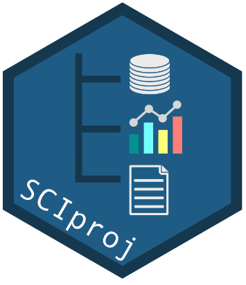

<!-- README.md is generated from README.Rmd. Please edit that file -->

# SCIproj 

[](https://github.com/saskiaotto)
[](LICENSE)

An R package for the initialization and organization of a scientific
project following reproducible research and
[FAIR](https://www.go-fair.org/fair-principles/) principles.

## Overview

SCIproj is an R package that allows users to initialize a project
through its function `create_proj()` and manage a scientific project as
an R package or a research compendium. This combines **structure**,
where files are located, and **workflow**, how analyses are reproduced
or replicated.

The package is built on modern reproducibility standards and guidelines
such as:

- [**FAIR Principles**](https://www.go-fair.org/fair-principles/) -
  Findable, Accessible, Interoperable, Reusable research outputs
- [**rOpenSci Reproducibility
  Guide**](https://ropensci-archive.github.io/reproducibility-guide/) -
  Best practices for reproducible research in R
- [**TIER Protocol**](https://www.projecttier.org/) - Standards for
  transparent and reproducible data analysis
- [**NASA TOPS**](https://science.nasa.gov/open-science/tops/) - Open
  science and reproducibility guidelines

### Defaults

The package has some default settings to ensure reproducibility. These
include:

- **[renv](https://rstudio.github.io/renv/)** for dependency management:
  locks exact package versions for full reproducibility
- **[targets](https://docs.ropensci.org/targets/)** for pipeline-based
  workflow: allows for automated dependency tracking, caching, and
  selective re-execution
- **CITATION.cff** for machine-readable citation metadata (FAIR/open
  science)
- **DATA_SOURCES.md** for documenting data provenance (source, license,
  DOI)
- **CONTRIBUTING.md** for contribution guidelines
- **Git** version control

### Project structure

    your-project/
    ├── DESCRIPTION             # Project metadata, dependencies, and author info (with ORCID).
    ├── README.Rmd              # Top-level project description.
    ├── your-project.Rproj      # RStudio project file.
    ├── CITATION.cff            # Machine-readable citation metadata for FAIR compliance.
    ├── CONTRIBUTING.md         # Contribution guidelines.
    ├── LICENSE.md              # Full license text (optional, requires add_license).
    ├── NAMESPACE               # Auto-generated by roxygen2 (do not edit by hand).
    │
    ├── data-raw/               # Raw data files and pre-processing scripts.
    │   ├── clean_data.R        # Script template for data cleaning.
    │   ├── DATA_SOURCES.md     # Data provenance: source, license, DOI, download date.
    │   └── ...
    │
    ├── data/                   # Cleaned datasets stored as .rda files.
    │
    ├── R/                      # Custom R functions and dataset documentation.
    │   ├── function_ex.R       # Template for custom functions.
    │   ├── data.R              # Template for dataset documentation.
    │   └── ...
    │
    ├── analyses/               # R scripts or R Markdown/Quarto documents for analyses.
    │   ├── figures/            # Generated plots.
    │   └── ...
    │
    ├── docs/                   # Publication-ready documents (article, report, presentation).
    ├── trash/                  # Temporary files that can be safely deleted.
    │
    ├── _targets.R              # Pipeline definition for reproducible workflow (default).
    ├── renv/                   # renv library and settings (default).
    ├── renv.lock               # Lockfile for reproducible package versions (default).
    └── Dockerfile              # Container definition for full reproducibility (optional).

### Why an R package as research compendium?

- **Separation of concerns**: Raw data, clean data, functions, analyses,
  and manuscripts each live in dedicated folders.
- **Documented data**: Clean datasets are stored as .rda files with
  roxygen documentation.
- **Reproducible workflow**: The `targets` pipeline tracks dependencies
  automatically - only re-run what changed.
- **Locked dependencies**: `renv` ensures the exact same package
  versions are used everywhere.
- **Citable and FAIR**: `CITATION.cff` makes the project
  machine-readable and citable, `DATA_SOURCES.md` documents data
  provenance.
- **Load and go**: `devtools::load_all()` instantly makes all clean
  datasets and custom functions available.

## Installation and usage

Install the development version from GitHub:

``` r
### Using remotes
# install.packages("remotes")
remotes::install_github("saskiaotto/SCIproj")

### Or better: using the new pak package
# install.packages("pak")
pak::pkg_install("saskiaotto/SCIproj")
```

### Creating the project

``` r
library("SCIproj")
create_proj("my_research_project")
```

This creates a project with `renv`, `targets`, `CITATION.cff`, and
`DATA_SOURCES.md` by default.

Customize with parameters:

``` r
### Full-featured project with GitHub, CI, and ORCID
create_proj("my_research_project",
  add_license = "MIT",
  license_holder = "Jane Doe",
  orcid = "0000-0001-2345-67893",
  create_github_repo = TRUE,
  ci = "gh-actions"
)

### Minimal project without workflow tools
create_proj("my_research_project",
  use_renv = FALSE,
  use_targets = FALSE
)
```

### Parameters

| Parameter | Default | Description |
|:---|:---|:---|
| `data_raw` | `TRUE` | Add `data-raw/` folder with templates |
| `makefile` | `FALSE` | Add `makefile.R` template |
| `testthat` | `FALSE` | Add testthat infrastructure |
| `use_pipe` | `FALSE` | Add magrittr pipe (native `\|>` recommended) |
| `add_license` | `NULL` | License type: `"MIT"`, `"GPL"`, `"Apache"`, etc. |
| `license_holder` | `"Your name"` | License holder / project author |
| `orcid` | `NULL` | ORCID iD for CITATION.cff |
| `use_git` | `TRUE` | Initialize local git repo |
| `create_github_repo` | `FALSE` | Create GitHub repo (needs `GITHUB_PAT`) |
| `ci` | `"none"` | CI type: `"none"` or `"gh-actions"` |
| `use_renv` | `TRUE` | Initialize renv for dependency management |
| `use_targets` | `TRUE` | Add `_targets.R` pipeline template |
| `use_docker` | `FALSE` | Add Dockerfile template |
| `open_proj` | `FALSE` | Open new project in RStudio |

### Developing the project

1.  Create the project with `create_proj()`.

2.  Edit `DESCRIPTION` with project metadata: title, summary,
    contributors (with ORCID), license, dependencies.

3.  Edit `README.Rmd` with project details: objectives, timeline,
    workflow.

4.  **Document your data provenance** in `data-raw/DATA_SOURCES.md`:
    source, license, download date, DOI for each dataset.

5.  Place original (raw) data in `data-raw/`. Use `clean_data.R` (or
    more scripts) for pre-processing. Store clean datasets with
    `usethis::use_data()`.

6.  Document clean datasets using roxygen in `R/` (see template
    `data.R`). For details, see [Documenting
    data](https://r-pkgs.org/data.html#sec-documenting-data).

7.  Place custom functions in `R/` with roxygen documentation. See the
    [documentation chapter](https://r-pkgs.org/man.html) in the *R
    Packages* book.

8.  Write tests for your functions in `tests/` (set `testthat = TRUE` in
    `create_proj()`). See [Testing
    basics](https://r-pkgs.org/testing-basics.html).

9.  Place analysis scripts/notebooks in `analyses/`. Save plots in
    `analyses/figures/`.

10. Place final manuscripts, reports, and presentations in `docs/`. Use
    R Markdown, Quarto, or templates from
    [rticles](https://github.com/rstudio/rticles),
    [thesisdown](https://github.com/ismayc/thesisdown), or [Quarto
    journal
    extensions](https://quarto.org/docs/extensions/listing-journals.html).

11. Keep dependencies in sync: `usethis::use_package()` for DESCRIPTION,
    `renv::snapshot()` for the lockfile.

12. **Update `CITATION.cff`** when you archive your project or publish.

### Workflow

- **Load the project**: `devtools::load_all()` or <kbd>Ctrl/Cmd +
  Shift + L</kbd> in RStudio.
- **Build documentation**: `devtools::document()` or <kbd>Ctrl/Cmd +
  Shift + D</kbd>.
- **Run tests**: `devtools::test()` or <kbd>Ctrl/Cmd + Shift + T</kbd>.
- **Run the pipeline**: `targets::tar_make()` to execute all targets.
  `targets::tar_visnetwork()` to visualize dependencies.
- **Update lockfile**: `renv::snapshot()` after installing or updating
  packages.

For a detailed introduction to `targets`, see the [user
manual](https://books.ropensci.org/targets/).

For maximum reproducibility, consider also using
[Docker](https://www.docker.com/) (`use_docker = TRUE`). See the [Rocker
Project](https://rocker-project.org/) for R-specific Docker images.

### Archiving and DOI

When your project is finalized:

1.  [Archive the GitHub
    repo](https://docs.github.com/en/github/creating-cloning-and-archiving-repositories/archiving-repositories)
    to make it read-only.
2.  Get a DOI via [Zenodo](https://zenodo.org/) (integrates directly
    with GitHub) or another [DOI Registration
    Agency](https://www.doi.org/registration_agencies.html).
3.  Update `CITATION.cff` with the DOI.
4.  Optionally, generate a `codemeta.json` with
    `codemetar::write_codemeta()` for richer metadata.

------------------------------------------------------------------------

## Useful resources

### Guidelines and standards

- [FAIR Principles](https://www.go-fair.org/fair-principles/) -
  Findable, Accessible, Interoperable, Reusable
- [TIER Protocol](https://www.projecttier.org/) - Teaching Integrity in
  Empirical Research
- [NASA TOPS Open
  Science](https://science.nasa.gov/open-science/tops/) - Transform to
  Open Science
- [The Turing Way](https://book.the-turing-way.org/) - A guide to
  reproducible, ethical, and collaborative data science
- The rOpenSci guide: [Reproducibility in
  Science](https://ropensci-archive.github.io/reproducibility-guide/)

### R packages and tools

- [R Packages (2nd edition)](https://r-pkgs.org/) by Hadley Wickham and
  Jenny Bryan
- [The targets R Package User
  Manual](https://books.ropensci.org/targets/) by Will Landau
- [renv: Project Environments](https://rstudio.github.io/renv/)

### Research compendium concept

- Gentleman, R. & Temple Lang, D. (2004): [Statistical Analyses and
  Reproducible
  Research](https://biostats.bepress.com/bioconductor/paper2/).
  Bioconductor Project Working Papers. Working Paper 2
- Noble, W.S. (2009): A Quick Guide to Organizing Computational Biology
  Projects. PLoS Comput Biol 5(7): e1000424.
  <https://doi.org/10.1371/journal.pcbi.1000424>
- Marwick, B., Boettiger, C., & Mullen, L. (2018). Packaging data
  analytical work reproducibly using R (and friends). The American
  Statistician 72(1), 80-88.
  <https://doi.org/10.1080/00031305.2017.1375986>
- Karthik Ram (2019): [How To Make Your Data Analysis Notebooks More
  Reproducible](https://github.com/karthik/rstudio2019). Presentation at
  the rstudio::conf(2019)

## Credits

- Francisco Rodriguez-Sanchez and his [template
  package](https://github.com/Pakillo/template)
- Ben Marwick and his [rrtools
  package](https://github.com/benmarwick/rrtools)
- The group of participants in the Reproducible Science Curriculum
  Workshop that created the [rr-init
  package](https://github.com/Reproducible-Science-Curriculum/rr-init#readme)
